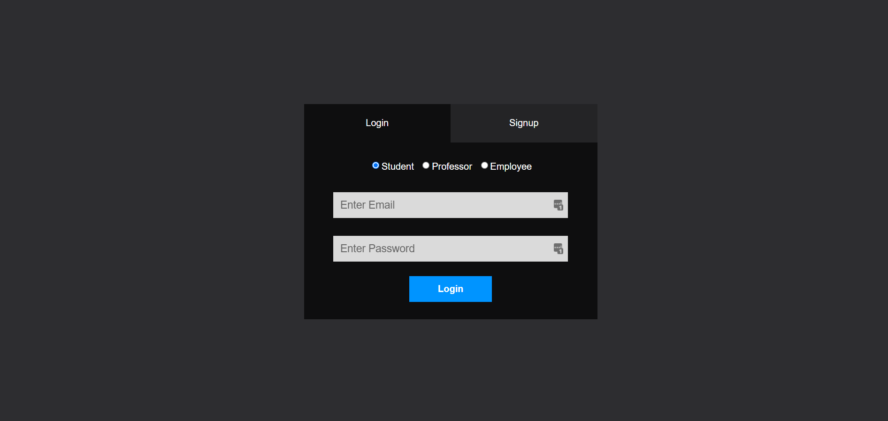
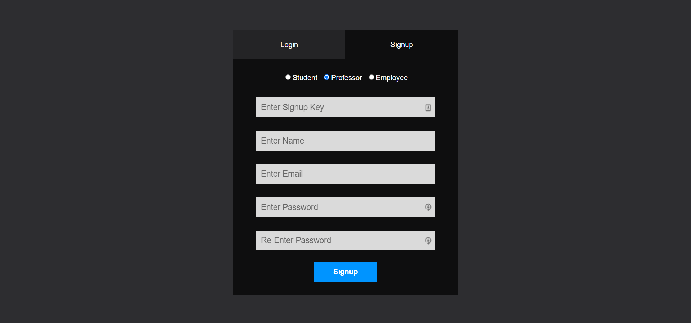
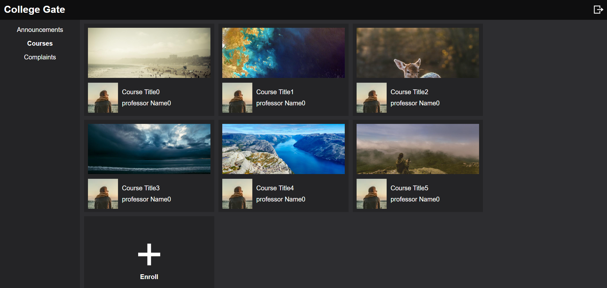
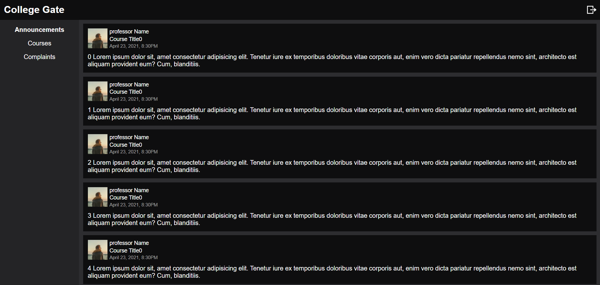
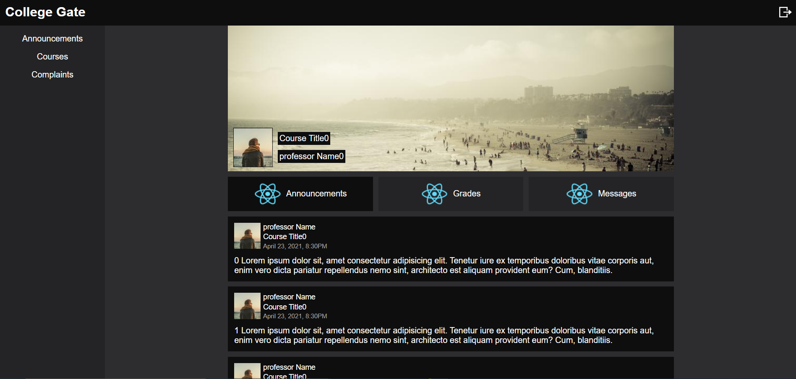
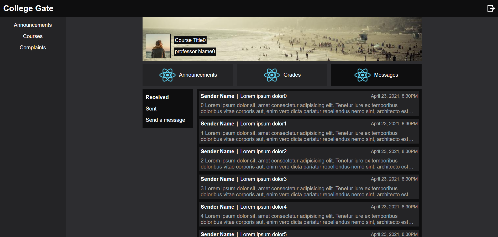
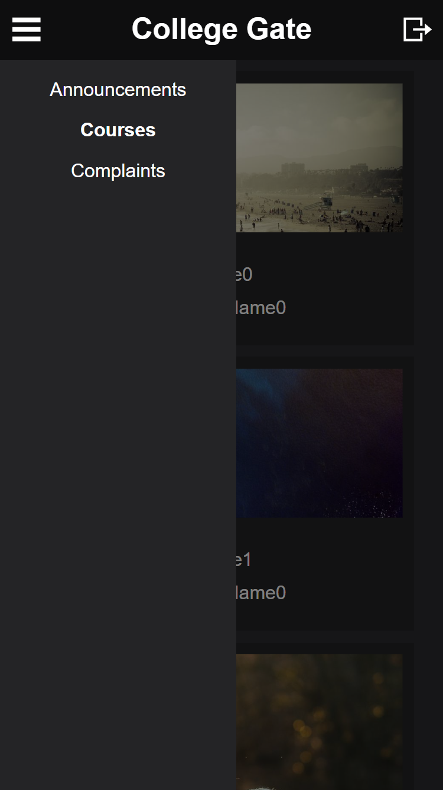
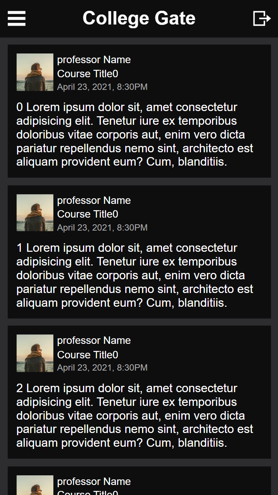
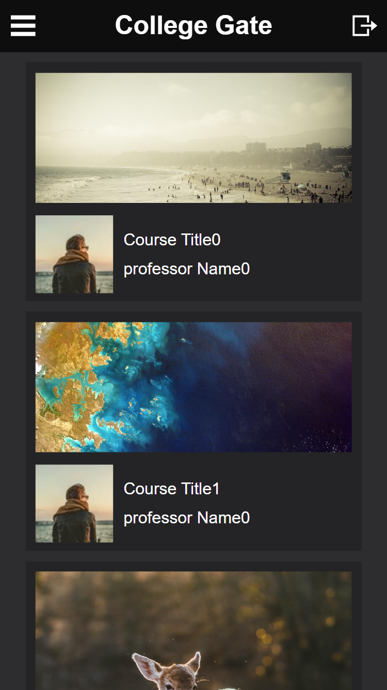

## About 
> A Web Portal concerned with college students, facilitating communication with faculty members and student services.

## Built using
- ReactJS https://reactjs.org/
- React Redux https://react-redux.js.org/
- HTML/CSS

## Running
- First `npm install`.
### Using the mock server
- Not fully working. It was just temporary until the real server was up and running. It may crash the app.
1) Install node.js.
2) Open the terminal.
2) Install json-server. `npm install -g json-server` or head to their github page for more detailes. https://github.com/typicode/json-server
3) cd into the `json-server` folder.
4) Check the server ip at the end of the `server.js` file as it should match your local ip. Or you can change it to `localhost` if you want.
4) Execute `node server`.

### Using the real server
- Clone https://github.com/youssefEdrees/College-Gate-Backend and run the server.

### After running the server
- Head to the `src ` folder and open `Constants.js` to check the server url (`BASE_URL`).
- Now you can just `npm start`.

## Showcasing

- Responsive

| menu | announcements | courses |
|:----:|:----:|:----:|
|||| 

